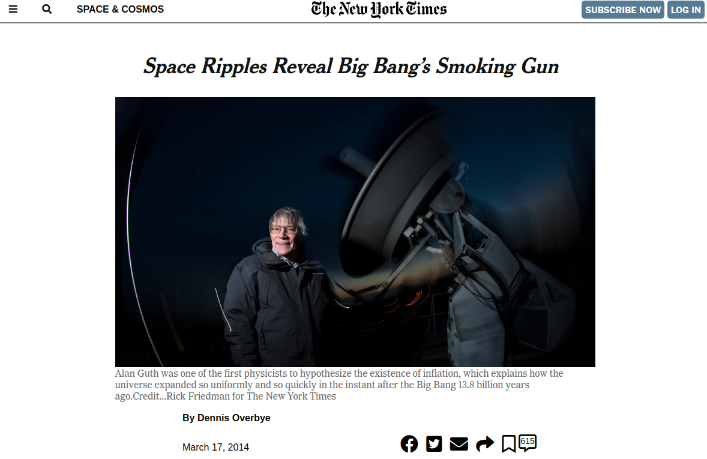

# New York times article
This is clone repo of NY times article.

## Built With

HTML and CSS

## Live Demo
[Click here](https://htmlpreview.github.io/?https://github.com/SarvarKh/Project-Sneak-Peek-1/blob/feature/index.html)

## Getting Started

This is a cloned web page from a [NY Times article](https://www.nytimes.com/2014/03/18/science/space/detection-of-waves-in-space-buttresses-landmark-theory-of-big-bang.html?_r=0)

## Authors

* Sarvar Khalimov

GitHub: @SarvarKh

[LinkedIn](https://www.linkedin.com/in/sarvar-khalimov-208797143/)

* Angel Barros

GitHub: @Zappat0n

[LinkedIn](https://www.linkedin.com/in/angel-luis-barros-pazos-8889011b5/)

## 🤝 Contributing

Contributions, issues, and feature requests are welcome!

Feel free to check the issues page.

## Show your support

Give a ⭐️ if you like this project!

## Acknowledgments

Hat tip to anyone whose code was used
Inspiration
etc

## License

This project is MIT licensed.
